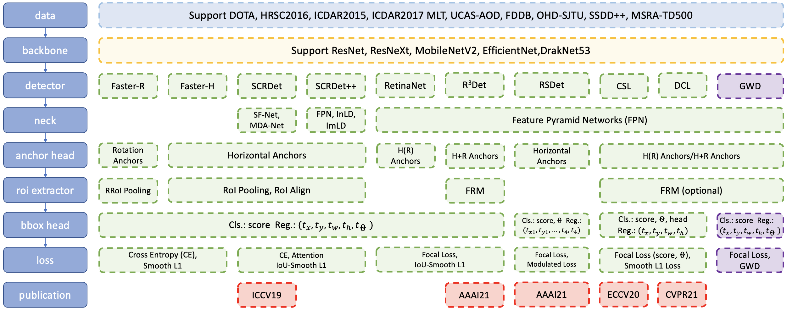
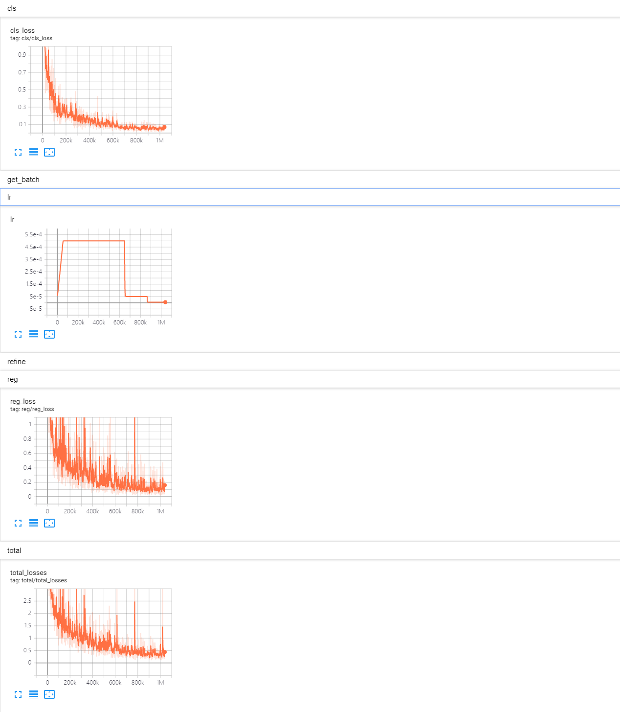

# UranusDet

## Abstract
This is a tensorflow-based rotation detection benchmark, also called UranusDet. 
UranusDet is completed by [YangXue](https://yangxue0827.github.io/).

**Papers and codes related to remote sensing/aerial image detection: [DOTA-DOAI](https://github.com/SJTU-Thinklab-Det/DOTA-DOAI).**      

Techniques:
- [x] Dataset: DOTA, HRSC2016, ICDAR2015, ICDAR2017 MLT, UCAS-AOD, FDDB, OHD-SJTU, SSDD++
- [x] Baackbone: [ResNet](https://arxiv.org/abs/1512.03385), [MobileNetV2](https://arxiv.org/abs/1801.04381), [EfficientNet](https://arxiv.org/abs/1905.11946), [DarkNet53](https://arxiv.org/abs/1506.02640)
- [x] Neck: [FPN](https://arxiv.org/abs/1708.02002), [BiFPN](https://arxiv.org/abs/1911.09070)
- [x] Detectors: 
  - [x] [R<sup>2</sup>CNN](https://arxiv.org/abs/1706.09579): [TF code](https://github.com/DetectionTeamUCAS/R2CNN_Faster-RCNN_Tensorflow)
  - [ ] [RRPN](https://arxiv.org/pdf/1703.01086): [TF code](https://github.com/DetectionTeamUCAS/RRPN_Faster-RCNN_Tensorflow)
  - [x] [SCRDet](https://arxiv.org/abs/1811.07126): [R<sup>2</sup>CNN++](), [IoU-Smooth L1 Loss](https://github.com/DetectionTeamUCAS/RetinaNet_Tensorflow_Rotation)
  - [x] [RetinaNet-H, RetinaNet-R](https://arxiv.org/abs/1908.05612): [TF code](https://github.com/DetectionTeamUCAS/RetinaNet_Tensorflow_Rotation)
  - [x] [RefineRetinaNet (CascadeRetinaNet)](https://arxiv.org/abs/1908.05612): [TF code](https://github.com/Thinklab-SJTU/R3Det_Tensorflow)
  - [ ] [RSDet](https://arxiv.org/abs/1911.08299)
  - [x] [R<sup>3</sup>Det](https://arxiv.org/abs/1908.05612): [TF code](https://github.com/Thinklab-SJTU/R3Det_Tensorflow), [Pytorch code](https://github.com/SJTU-Thinklab-Det/r3det-on-mmdetection)
  - [x] [Circular Smooth Label (CSL)](https://arxiv.org/abs/2003.05597): [TF code](https://github.com/Thinklab-SJTU/CSL_RetinaNet_Tensorflow)
  - [ ] [Densely Coded Label (DCL)](): [TF code](https://github.com/Thinklab-SJTU/DCL_RetinaNet_Tensorflow)
  - [ ] Mixed method: R<sup>3</sup>Det-DCL
- [x] Loss: CE, [Focal Loss](https://arxiv.org/abs/1708.02002), [Smooth L1 Loss](https://arxiv.org/abs/1504.08083), [IoU-Smooth L1 Loss](https://arxiv.org/abs/1811.07126)


## Projects


## Latest Performance

More results and trained models are available in the [MODEL_ZOO.md](MODEL_ZOO.md).

### DOTA1.0 (Task1)
| Model |  Neck  |    Backbone    |    Training/test dataset    |    mAP   | Model Link | Anchor | Angle Pred. | Reg. Loss| Angle Range | Data Augmentation | Configs |      
|:------------:|:------------:|:------------:|:------------:|:-----------:|:----------:|:-----------:|:-----------:|:-----------:|:---------:|:---------:|:---------:|    
| [RetinaNet-H](https://arxiv.org/abs/1908.05612) | FPN | ResNet50_v1d 600->800 | DOTA1.0 trainval/test | 64.17 | [Baidu Drive (j5l0)](https://pan.baidu.com/s/1Qh_LE6QeGsOBYqMzjAESsA) | H | Reg. | smooth L1 | **180** | × | [cfgs_res50_dota_v15.py](./libs/configs/DOTA/retinanet/cfgs_res50_dota_v15.py) |
| [RetinaNet-H](https://arxiv.org/abs/1908.05612) | FPN | ResNet50_v1d 600->800 | DOTA1.0 trainval/test | 65.73 | [Baidu Drive (jum2)](https://pan.baidu.com/s/19-hEtCGxLfYuluTATQJpdg) | H | Reg. | smooth L1 | **90** | × | [cfgs_res50_dota_v4.py](./libs/configs/DOTA/retinanet/cfgs_res50_dota_v4.py) |
| [CSL](https://arxiv.org/abs/2003.05597) | FPN | ResNet50_v1d 600->800 | DOTA1.0 trainval/test | 67.38 | [Baidu Drive (g3wt)](https://pan.baidu.com/s/1nrIs-oYA53qQzlPjqYkMJQ) | H | **Cls.: Gaussian (r=1, w=10)** | smooth L1 | 180 | x | [cfgs_res50_dota_v45.py](./libs/configs/DOTA/csl/cfgs_res50_dota_v45.py) |
| [DCL]() | FPN | ResNet50_v1d 600->800 | DOTA1.0 trainval/test | 67.39 | [Baidu Drive (p9tu)](https://pan.baidu.com/s/1TZ9V0lTTQnMhiepxK1mdqg) | H | **Cls.: BCL (w=180/256)** | smooth L1 | 180 | × | [cfgs_res50_dota_dcl_v5.py](./libs/configs/DOTA/dcl/cfgs_res50_dota_dcl_v5.py) |
| [R<sup>3</sup>Det](https://arxiv.org/abs/1908.05612) | FPN | ResNet50_v1d 600->800 | DOTA1.0 trainval/test | 70.66 | [Baidu Drive (30lt)](https://pan.baidu.com/s/143sGeLNjXzcpxi9GV7FVyA) | H->R | Reg. | smooth L1 | 90 | × | [cfgs_res50_dota_r3det_v1.py](./libs/configs/DOTA/r3det/cfgs_res50_dota_r3det_v1.py) |
| **[R<sup>3</sup>Det-DCL]()** | FPN | ResNet50_v1d 600->800 | DOTA1.0 trainval/test | 71.21 | [Baidu Drive (jueq)](https://pan.baidu.com/s/1XR31i3T-C5R16giBxQUNWw) | H->R | **Cls.: BCL (w=180/256)** | iou-smooth L1 | 90->180 | × | [cfgs_res50_dota_r3det_dcl_v1.py](./libs/configs/DOTA/r3det_dcl/cfgs_res50_dota_r3det_dcl_v1.py) |
| [R<sup>2</sup>CNN](https://arxiv.org/abs/1706.09579) | FPN | ResNet50_v1d 600->800 | DOTA1.0 trainval/test | 72.27 | [Baidu Drive (wt2b)](https://pan.baidu.com/s/1R_31U2jl7gj6OMvirURnsg) | H->R | Reg. | smooth L1 | 90 | × | [cfgs_res50_dota_v1.py](./libs/configs/DOTA/r2cnn/cfgs_res50_dota_v1.py) |
<!-- | **[R<sup>3</sup>Det-DCL]()** | FPN | ResNet152_v1d 600->MS (+Flip) | DOTA1.0 trainval/test | 76.70 (+0.27) | [Baidu Drive (2iov)](https://pan.baidu.com/s/1UVcCrhcUwTFvWpJaoIToCA) | H->R | **Cls.: BCL (w=180/256)** | iou-smooth L1 | 90->180 | √| [cfgs_res152_dota_r3det_dcl_v1.py](./libs/configs/DOTA/r3det_dcl/cfgs_res152_dota_r3det_dcl_v1.py) | -->
<!-- | [R<sup>3</sup>Det](https://arxiv.org/abs/1908.05612) | FPN | ResNet152_v1d 600->MS (+Flip) | DOTA1.0 trainval/test | 76.23 (+0.24) | [model](https://drive.google.com/file/d/1GkpiSPN-cAnvDISk5d4kjrV3Tqti_mbj/view?usp=sharing) | H + R | Reg. | iou-smooth L1 | 90 | √ | [cfgs_res152_dota_r3det_v3.py](./libs/configs/DOTA/r3det/cfgs_res152_dota_r3det_v3.py) |      -->

## My Development Environment
**docker images: docker pull yangxue2docker/yx-tf-det:tensorflow1.13.1-cuda10-gpu-py3**      
1. python3.5 (anaconda recommend)               
2. cuda 10.0                     
3. [opencv(cv2)](https://pypi.org/project/opencv-python/)       
4. [tfplot 0.2.0](https://github.com/wookayin/tensorflow-plot) (optional)            
5. tensorflow-gpu 1.13                              

## Download Model
### Pretrain weights
1. Please download [resnet50_v1](http://download.tensorflow.org/models/resnet_v1_50_2016_08_28.tar.gz), [resnet101_v1](http://download.tensorflow.org/models/resnet_v1_101_2016_08_28.tar.gz), [resnet152_v1](http://download.tensorflow.org/models/resnet_v1_152_2016_08_28.tar.gz), [efficientnet](https://github.com/tensorflow/tpu/tree/master/models/official/efficientnet), [mobilenet_v2](https://storage.googleapis.com/mobilenet_v2/checkpoints/mobilenet_v2_1.0_224.tgz), darknet53 ([Baidu Drive (1jg2)](https://pan.baidu.com/s/1p8V9aaivo9LNxa_OjXjUwA), [Google Drive](https://drive.google.com/drive/folders/1zyg1bvdmLxNRIXOflo_YmJjNJdpHX2lJ?usp=sharing)) pre-trained models on Imagenet, put them to $PATH_ROOT/dataloader/pretrained_weights.       
2. **(Recommend in this repo)** Or you can choose to use better backbones (resnet_v1d), refer to [gluon2TF](https://github.com/yangJirui/gluon2TF).    
* [Baidu Drive (5ht9)](https://pan.baidu.com/s/1GpqKg0dOaaWmwshvv1qWGg)          
* [Google Drive](https://drive.google.com/drive/folders/1BM8ffn1WnsRRb5RcuAcyJAHX8NS2M1Gz?usp=sharing)      

### Trained weights
1. Please download trained models by this project, then put them to $PATH_ROOT/output/pretained_weights.

## Compile
    ```  
    cd $PATH_ROOT/libs/utils/cython_utils
    python setup.py build_ext --inplace (or make)
    
    cd $PATH_ROOT/libs/utils/
    python setup.py build_ext --inplace
    ```

## Train 

1. If you want to train your own dataset, please note:  
    ```
    (1) Select the detector and dataset you want to use, and mark them as #DETECTOR and #DATASET (such as #DETECTOR=retinanet and #DATASET=DOTA)
    (2) Modify parameters (such as CLASS_NUM, DATASET_NAME, VERSION, etc.) in $PATH_ROOT/libs/configs/#DATASET/#DETECTOR/cfgs_xxx.py
    (3) Copy $PATH_ROOT/libs/configs/#DATASET/#DETECTOR/cfgs_xxx.py to $PATH_ROOT/libs/configs/cfgs.py
    (4) Add category information in $PATH_ROOT/libs/label_name_dict/label_dict.py     
    (5) Add data_name to $PATH_ROOT/data/io/read_tfrecord.py  
    ```     

2. Make tfrecord       
    If image is very large (such as DOTA dataset), the image needs to be cropped. Take DOTA dataset as a example:      
    ```  
    cd $PATH_ROOT/dataloader/dataset/DOTA
    python data_crop.py
    ```  
    If image does not need to be cropped, just convert the annotation file into xml format, refer to [example.xml](./example.xml).
    ```  
    cd $PATH_ROOT/dataloader/dataset/  
    python convert_data_to_tfrecord.py --VOC_dir='/PATH/TO/DOTA/' 
                                       --xml_dir='labeltxt'
                                       --image_dir='images'
                                       --save_name='train' 
                                       --img_format='.png' 
                                       --dataset='DOTA'
    ```      
    

3. Start training
    ```  
    cd $PATH_ROOT/tools/#DETECTOR
    python train.py
    ```

## Test
1. For large-scale image, take DOTA dataset as a example (the output file or visualization is in $PATH_ROOT/tools/#DETECTOR/test_dota/VERSION): 
    ```  
    cd $PATH_ROOT/tools/#DETECTOR
    python test_dota_ms.py --test_dir='/PATH/TO/IMAGES/'  
                           --gpus=0,1,2,3,4,5,6,7  
                           -ms (multi-scale testing, optional)
                           -s (visualization, optional)
    ``` 

    **Notice: In order to set the breakpoint conveniently, the read and write mode of the file is' a+'. If the model of the same #VERSION needs to be tested again, the original test results need to be deleted.**

2. For small-scale image, take HRSC2016 dataset as a example: 
    ```  
    cd $PATH_ROOT/tools/#DETECTOR
    python test_hrsc2016_ms.py --test_dir='/PATH/TO/IMAGES/'  
                               --gpu=0
                               --image_ext='bmp'
                               --test_annotation_path='/PATH/TO/ANNOTATIONS'
                               -s (visualization, optional)
    ``` 

## Tensorboard
```  
cd $PATH_ROOT/output/summary
tensorboard --logdir=.
``` 




## Citation

If this is useful for your research, please consider cite.

```
@article{yang2020arbitrary,
    title={Arbitrary-Oriented Object Detection with Circular Smooth Label},
    author={Yang, Xue and Yan, Junchi},
    journal={European Conference on Computer Vision (ECCV)},
    year={2020}
    organization={Springer}
}

@article{yang2019r3det,
    title={R3Det: Refined Single-Stage Detector with Feature Refinement for Rotating Object},
    author={Yang, Xue and Liu, Qingqing and Yan, Junchi and Li, Ang and Zhang, Zhiqiang and Yu, Gang},
    journal={arXiv preprint arXiv:1908.05612},
    year={2019}
}

@article{yang2020scrdet++,
    title={SCRDet++: Detecting Small, Cluttered and Rotated Objects via Instance-Level Feature Denoising and Rotation Loss Smoothing},
    author={Yang, Xue and Yan, Junchi and Yang, Xiaokang and Tang, Jin and Liao, Wenglong and He, Tao},
    journal={arXiv preprint arXiv:2004.13316},
    year={2020}
}

@inproceedings{yang2019scrdet,
    title={SCRDet: Towards more robust detection for small, cluttered and rotated objects},
    author={Yang, Xue and Yang, Jirui and Yan, Junchi and Zhang, Yue and Zhang, Tengfei and Guo, Zhi and Sun, Xian and Fu, Kun},
    booktitle={Proceedings of the IEEE International Conference on Computer Vision (ICCV)},
    pages={8232--8241},
    year={2019}
}

@inproceedings{xia2018dota,
    title={DOTA: A large-scale dataset for object detection in aerial images},
    author={Xia, Gui-Song and Bai, Xiang and Ding, Jian and Zhu, Zhen and Belongie, Serge and Luo, Jiebo and Datcu, Mihai and Pelillo, Marcello and Zhang, Liangpei},
    booktitle={Proceedings of the IEEE Conference on Computer Vision and Pattern Recognition (CVPR)},
    pages={3974--3983},
    year={2018}
}

```

## Reference
1、https://github.com/endernewton/tf-faster-rcnn   
2、https://github.com/zengarden/light_head_rcnn   
3、https://github.com/tensorflow/models/tree/master/research/object_detection    
4、https://github.com/fizyr/keras-retinanet     


